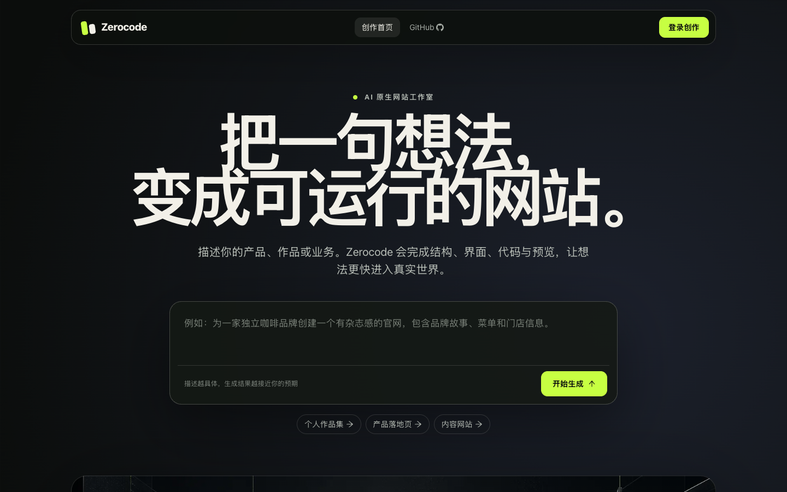
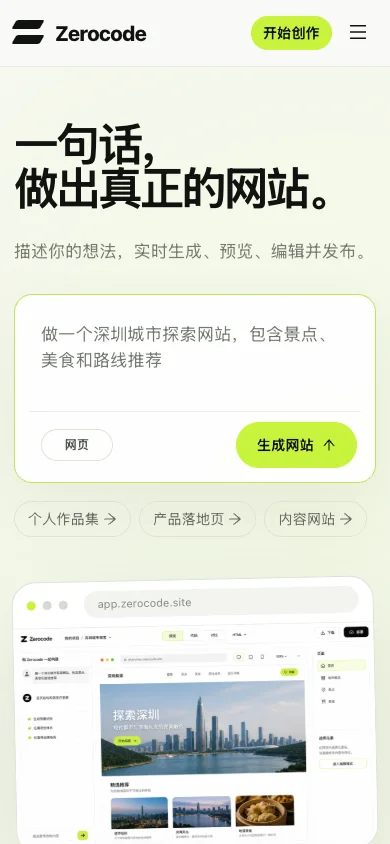
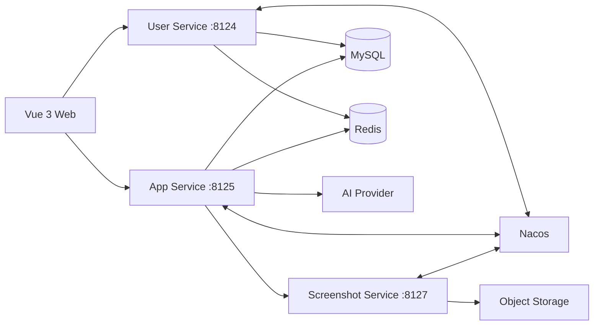

# Zerocode Microservice


从一句自然语言需求开始，生成、预览、修改、下载并发布一个可访问的网站。仓库采用前后端单仓结构，包含 Vue 3 创作工作台和 Spring Boot 微服务。

[在线体验](https://zerocode-microservice.yray1202.workers.dev)



<p align="center">
  
</p>

## 功能

- 账号注册、登录与会话管理
- AI 意图路由与流式代码生成
- HTML、Vue 项目实时预览
- 对话式修改、源码压缩包下载
- 一键部署生成结果
- 用户、应用、对话管理后台
- AI 服务异常时的本地 HTML 降级生成
- 桌面端与移动端响应式界面

## 架构



| 模块 | 作用 | 端口 |
| --- | --- | ---: |
| `zerocode-frontend` | Vue 3 创作与管理界面 | 5173 |
| `zerocode-user` | 用户、登录、权限 | 8124 |
| `zerocode-app` | 应用、生成、预览、部署 | 8125 |
| `zerocode-screenshot` | 截图与对象存储 | 8127 |
| Nacos | 服务发现 | 8848 |
| MySQL | 业务数据 | 3307 |
| Redis | 会话与缓存 | 6379 |

## 本地启动

需要 Java 21、Maven 3.9、Node.js 22、Docker。

```bash
git clone https://github.com/RAY-1202/Zerocode-Microservice.git
cd Zerocode-Microservice

cp zerocode-user/src/main/resources/application.example.yml zerocode-user/src/main/resources/application.yml
cp zerocode-app/src/main/resources/application.example.yml zerocode-app/src/main/resources/application.yml
cp zerocode-screenshot/src/main/resources/application.example.yml zerocode-screenshot/src/main/resources/application.yml

docker compose up -d mysql redis nacos
mvn clean install -DskipTests
```

在三个终端中启动后端服务：

```bash
mvn -pl zerocode-user spring-boot:run
mvn -pl zerocode-app spring-boot:run
mvn -pl zerocode-screenshot spring-boot:run
```

启动前端：

```bash
cd zerocode-frontend
npm ci
npm run dev
```

访问 `http://localhost:5173`。三个服务的接口文档分别位于：

- `http://localhost:8124/api/doc.html`
- `http://localhost:8125/api/doc.html`
- `http://localhost:8127/api/doc.html`

## 配置

真实配置文件 `application.yml`、`.env.local` 已加入忽略列表。请从 `application.example.yml` 复制，并通过环境变量提供这些值：

| 类别 | 环境变量 |
| --- | --- |
| 数据库 | `MYSQL_URL`、`MYSQL_USERNAME`、`MYSQL_PASSWORD` |
| Redis | `REDIS_HOST`、`REDIS_PORT`、`REDIS_PASSWORD` |
| 服务发现 | `NACOS_ADDRESS` |
| 生成模型 | `AI_BASE_URL`、`AI_API_KEY`、`AI_MODEL` |
| 路由模型 | `ROUTING_AI_BASE_URL`、`ROUTING_AI_API_KEY`、`ROUTING_AI_MODEL` |
| 对象存储 | `COS_HOST`、`COS_SECRET_ID`、`COS_SECRET_KEY`、`COS_REGION`、`COS_BUCKET` |

请求和响应正文日志默认关闭，避免提示词、用户内容和授权信息进入日志。无可用生成模型时，HTML 模式会返回安全的本地模板，便于继续联调。

四条 AI 调用链默认统一使用 `https://api.deepseek.com` 和 `deepseek-v4-flash`，密钥仅通过 `AI_API_KEY` 注入。

## 测试

```bash
mvn test
cd zerocode-frontend
npm run build
npm audit
```

本次回归覆盖注册、登录、创建应用、流式生成、预览、下载、部署、编辑、精选切换，以及用户、应用、对话删除。桌面宽度 1440 px 和移动宽度 390 px 均完成浏览器检查。

## Cloudflare

Cloudflare Worker 在同一域名下提供前端静态资源和 `/api`。API 请求进入一个 Container，容器内运行三个 Spring Boot 服务、Redis 和 MariaDB，服务间调用使用本机 Dubbo Triple 端口。

部署配置位于 `zerocode-frontend/wrangler.jsonc`，容器镜像入口位于仓库根目录 `Dockerfile`：

```bash
cd zerocode-frontend
npm run build
npx wrangler deploy
```

也可以在 GitHub Actions 中手动运行 `Deploy Cloudflare` 工作流。部署前需要在 Cloudflare Worker Secret 中设置 `AI_API_KEY`、`MYSQL_PASSWORD` 和 `COS_*`，在 GitHub Secrets 中设置 `CLOUDFLARE_API_TOKEN`、`CLOUDFLARE_ACCOUNT_ID`。

当前在线版本定位为可完整体验的演示环境。Cloudflare Containers 本地磁盘为临时存储，实例被替换后业务数据和已生成文件会重置。需要长期保存线上用户数据时，将 `MYSQL_URL` 切换到受控网络中的外部 MySQL，并把生成产物迁移到对象存储。

## 目录

```text
.
├── zerocode-frontend       Vue 3 前端
├── zerocode-app            应用与 AI 生成服务
├── zerocode-user           用户服务
├── zerocode-screenshot     截图服务
├── zerocode-common         公共模型与工具
├── zerocode-client         Dubbo 服务接口
├── cloudflare              容器启动脚本
├── sql                     数据库结构
├── docs                    项目截图
└── compose.yaml            本地基础设施
```

## 视觉来源

界面使用 Taste 设计方法重构。首屏视觉由 GPT Image 生成后转为 WebP，提示词方向为黑色石墨背景、酸性绿色高光、模块化界面平面、无文字、无标志、无人物，并用于产品首屏展示。
